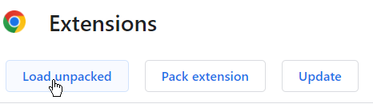
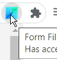
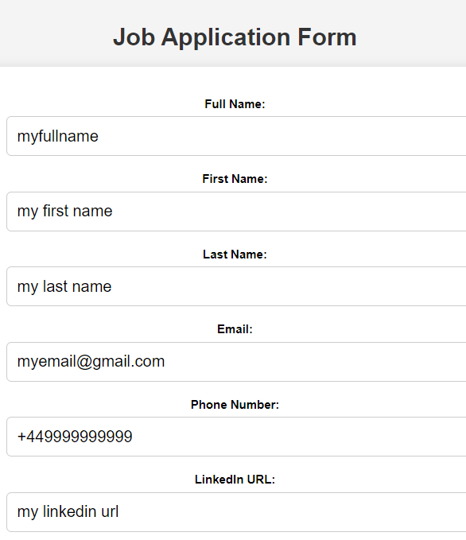
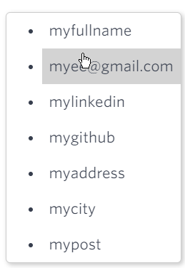

# Form Autofill Chrome Extension

## Introduction

The Form Autofill Chrome extension simplifies the process of filling out job application forms on websites by providing the following functionalities:

- Automatically fills detected form fields.
- Offers suggestions to populate input fields.

## Usage

### Installation

1. Visit the Chrome Web Store and download the "Form Autofill" extension or clone this github repository and manage extensions from chrome browser.

Then switch to Developer mode load unpacked and select the cloned folder

### Filling Out Forms

2. Click on the Form Autofill icon in your Chrome toolbar.
   
   

3. Fill out the form as needed. Your data is stored locally on your device and is not linked to your Google account.
   
   

4. To save your data, simply submit the form. If you wish to clear your saved data, submit the form with empty input fields.
   
   

5. You're all set! When you visit websites that require form filling, the extension will automatically assist you. If not, it will provide suggestions for quick input.

   

## Feedback and Support

We value your feedback! If you encounter any issues, have suggestions for improvement, or need assistance, please don't hesitate to reach out in github.

## License

This extension is open-source and distributed under the [MIT License](LICENSE.md).

